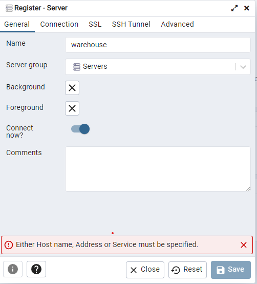
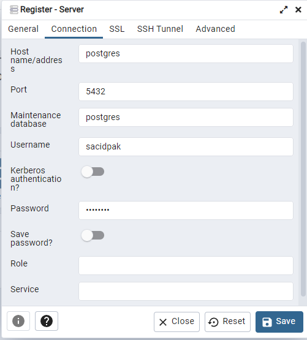
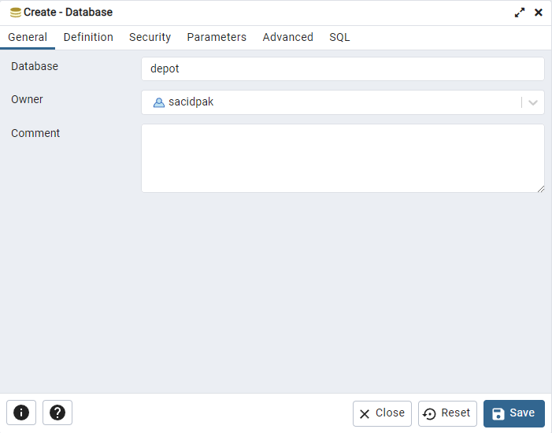

1- "docker compose up -d" command run

2- open browser and go to localhost:5050

3- set pgadmin password (whatever you want)

4-click add new server

5-set servername (whatever you want)

6-click connection tab and Hostname/address=postgres, username=sacidpak, password=password and click save button

7-right click and select new database from left navbar

8-set database name "depot" and click save button

9-repeat new database steps and set database name "product" and click save button

10-run again "docker compose up -d" command 

11-open browser and go to links -> 

    http://localhost:8080/swagger-ui/index.html#/

    http://localhost:8081/swagger-ui/index.html#/

